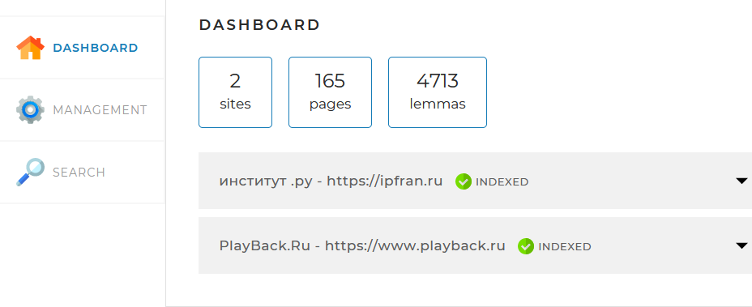
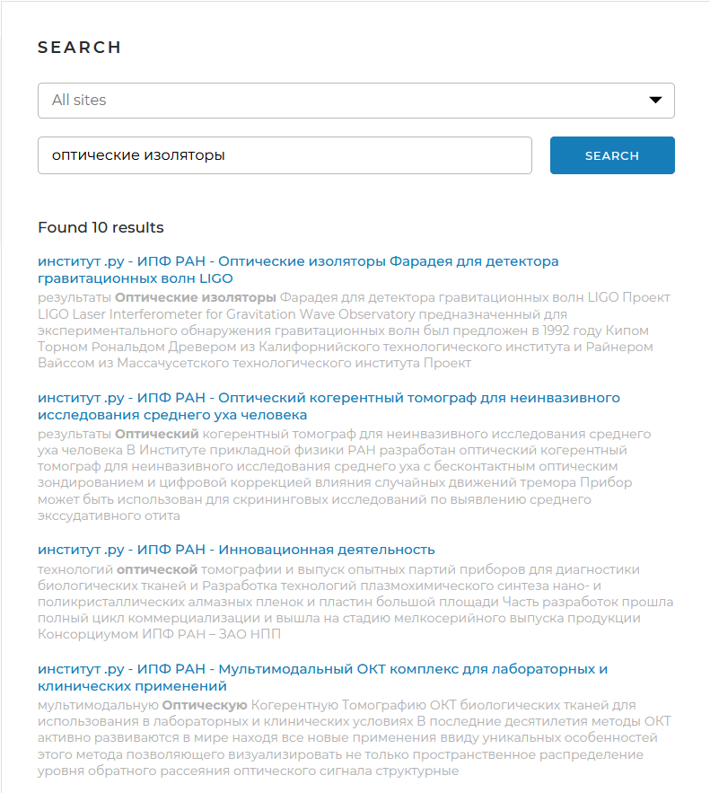
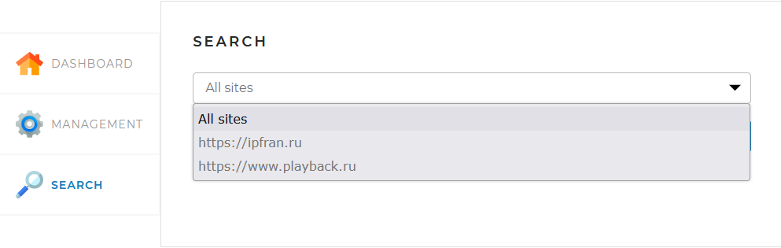

<h1 align="center">
Поисковый движок
</h1>
______________________________________________________________________________

_Создан на основе технического задания для студентов Skillbox._

<H3>Программа индексации и поиска информации по заданному списку web-сайтов
на основе фреймворка Spring с использованием БД MySQL.</H3>
 
 Проcтая и удобная к использованию программа с информативным интерфейсом, 

<h3> Преимущества </h3>

- Для тех, кто _почти нашел_, возможен поиск не по всем web-сайтам, а по выбранному сайту. Выпадающий список в окне
  выбора web-сайтов показывает сразу все сайты по которым производится поиск, что дополнительно освобождает от
  мучительного поиска файла конфигурации, в котором заданы индексируемые сайты.

- Поиск ведется исключительно по основным частям речи русского языка с частотой употребления слова не более количества
  вложенных страниц отдельного сайта.(Оптимальная величина для определения широкоупотребимого слова). Найденные
  соответствия искомых слов "подсвечиваются" в контексте жирным шрифтом.

- Для администраторов, информационная панель с подробной статистикой по каждому сайту и общей для всех сайтов
  информацией, а также быстрая индексация с возможностью индексации/переиндексации отдельных сайтов.

<h3> Индексация </h3>
<h4> Основной метод </h4>
В данной программе индексируются страницы, исключительно, имеющие адресацию от главной страницы сайта.
 
Индексация производится в три этапа:
- поиск всех страниц сайта начиная с главной,где использован рекурсивный метод 
обхода страниц посредством технологии многопоточности ForkJoinPool:
 
_Статический класс с расширением RecursiveTask_

`  public static class ReadAllLinks extends RecursiveTask {`

        public static Set<String> setLinks;
        public static SortedSet<String> resultLinks;
        public static String site;
        public static String line; } 

_имеет метод compute(), который создает задачи, передает их методу fork()
для асинхронного выполнения в пуле потоков, запускает и собирает результат методом join()._

` List<ReadAllLinks> taskList = new ArrayList<>();` 
`links.stream().map((link) -> link.attr("abs:href")).forEachOrdered((reference) -> {` 
`           if (setLinks.add(reference) && ((reference.contains("://" + site))|| (reference.contains("://www." + site)))) {`

                                resultLinks.add(reference);
                                ReadAllLinks task = new ReadAllLinks(reference);
                                task.fork();
                                taskList.add(task);
                            }
                        });
                        for (ReadAllLinks task : taskList) {
                            task.join();
                        }`

- анализ каждой страницы с обработкой заголовка и контента библиотекой Lucene для выявления всех основных частей речи (
  сущ., прил., гл.) и их сбора в список лемм (основная форма слова).  
  `List<String> listBasedForms = luceneMorphology.getNormalForms(word);`  
  `String basedForm = listBasedForms.get(0);`  
  `List<String> wordInfo = luceneMorphology.getMorphInfo(basedForm);`  
  `String[] info = wordInfo.get(0).split("\\|");`  
  `String[] wordReview = info[1].split(" ");`  
  `if (wordReview[1].matches("С") || (wordReview[1].matches("П")) ||
  (wordReview[1].matches("Г"))) {`  
  `listLemmas.add(basedForm); }`
- и, собственно, создание индекса посредством привязки id леммы к id страницы с дополнительным вычислением rank -
  количество данной леммы на данной странице.

<h3> Система поиска </h3>

Технология поиска основана на утверждении, что все основные части речи из поискового запроса должны быть присутствовать
на страницах из списка результатов поиска. Поиск производится в три этапа:  
**формирование списка лемм из поискового запроса -> формирование списка индексов из списка лемм ->
формирование списка страниц из имеющегося списка индексов с учетом того, что количество id страниц должно быть равно
количеству лемм (т.е. все три леммы есть на странице)**.  
Результат поиска кроме адреса страницы и заголовка содержит сниппет (часть текста с выделенными словами из поискового
запроса) размер которого 50 слов. Выбор части текста производится начиная с первого вхождения любого слова из поиска и
до первого вхождения последнего из набора слов.

<h3> Запуск и пользование </h3>

До запуска программы необходимо:

- иметь на компьютере локально установленную БД MySQL.
- определить область поиска (создать список сайтов).

Область поиска, логин и пароль к БД хранится в конфигурационном файле application.yaml, который находится в корне
проекта. Ввод логина и пароля для БД производится в разделе "spring/datasource"  
`username: root` 
`password: Alex1975`  
Для создания списка индексируемых сайтов, его изменения и/или удаления необходимо редактировать "url" и "name" сайта в
разделе "indexing-setting"  
`sites:` 
`- url: https://ipfran.ru` 
`name: ИПФ РАН.ру` 
`- url: https://www.playback.ru` 
`name: PlayBack.Ru` 

После запуска программы необходимо зайти по вкладку "Dashboard", где собрана вся статистика по индексируемым сайтам.

**Внимание ! Поиск будет производиться только по сайтам с пометкой "INDEXED" "**  
Пометка "INDEXED" означает, что сайт успешно проиндексирован, "INDEXING" - сайт находится
в процессе  индексации, "FAILED" - сайт не индексирован.  

Обнаружив, что все сайты отмечены "FAILED" еобходимо запустить полную индексацию сайтов. для этого необходимо зайти во
вкладку "Management", и запустить индексацию, поле "Add/update" должно оставаться пустым. Полная индексация производится
последовательно по списку сайтов и может быть прервана до ее завершения кнопкой "Stop", при этом индексируемый сайт
будет помечен как "FAILED", все данные по такому сайту будут удалены.

Для индексации отдельных сайтов необходимо в поле "Add/update" указать нужный сайт.
**_Внимание! Наличие сайтов с пометкой "INDEXING" означает, что индексация уже запущена, последующая индексация возможна
только после завершения либо остановки текущей._**

Для поиска информации используется вкладка "Search". В окне поиска введите искомую информацию и нажмите кнопку поиска.

Если результаты найдены, то первые десять результатов отобранные, как наиболее релевантные, отобразятся на экране. Общее
количество найденных страниц также выведено на экран.

Если сайт по которому необходимо искать уже известен можно выполнить поиск только по заданному сайту, предварительно
выбрав его в поле выбора сайта.

Для последующего поиска необходимо просто задать новый поисковый запрос.

Разработчик Алексей Фадеев

